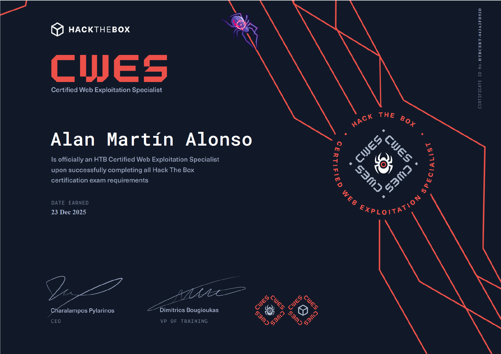

# Mi experiencia

<figure><figcaption></figcaption></figure>

Pues ha costado pero se ha conseguido, os cuento mi experiencia...

## <mark style="color:$danger;">Examen</mark>

Primero lo intenté justo antes de que el examen cambiase de nombre, antes se llamaba CBBH (Certified Bug Bounty Hunter), y ahora CWES (Certified Web Exploitation Specialist). Lo confirmo, es el mismo examen que anteriormente, tiene las mismas condiciones y es el mismo entorno.

En la primera vez que lo intenté, me bloqueé, no supe salir del bucle mental en el que entré y de diferentes _rabbit holes_ (callejones sin salida) que hay en el examen. Me rallé bastante, empecé a dudar de si tenía que volver a hacer todo el path de nuevo, etc.&#x20;

Me tomé unas semanas para ver como enfocarlo, ya que como el examen es tan largo (7 días para la explotación + el informe), tenía que hacerlo durante vacaciones, porque presentarse a este examen mientras estás trabajando, no lo recomiendo, ya que es necesario echarle bastantes horas diarias.

Repetí algunos skills assessment sin ningún tipo de guía, que según las preguntas del examen que vi durante mi primer intento eran los más importantes, hice las máquinas de Vulnyx que creó J4ckie0x17 para esta certificación (tenéis los [WriteUps ](../../writeups/vulnyx/)subidos) y además me hice mi propia checklist para realizar comprobaciones durante el examen e ir avanzando por las distintas fases del pentesting web.

Llegó el día y...empecé bastante bien, el primer día saqué 3 flags (las 2 que saqué en el primer intento + 1 más), luego seguí con mi checklist comprobando todo paso a paso, conseguí encontrar muchas más cosas que en mi primer intento y seguí apuntando todo, al tercer o cuarto día tenía ya 7 flags de 10 que hay totales, aunque necesitas 80 de 100 puntos totales para aprobar, hay flags que valen más puntos que otras, así que es algo a tener en cuenta.

Me quedé atascado en conseguir esos 10 últimos puntos para aprobar, probé todo lo que se me ocurría y parecía que nada funcionaba...investigué más y parecía que nada, que no lo iba a poder sacar, porque lo que estaba probando era la única forma de explotar eso que había encontrado...Pero se me ilumino la bombilla y pensé: Y si reinicio la máquina víctima a ver si se ha quedado tostada? **BINGO**.

Fue reiniciar la instancia, volver a realizar el ataque (cambiando algunos parámetros pero en lo fundamental era lo mismo), y funcionó, ya tenía mis 80/100 puntos para aprobar.

Todavía me quedaban 2 días de margen para la entrega y decidí intentar sacar las 2 preguntas que me quedaban. No sé si fue por la motivación de ya tener los 80 puntos o que me entró pero conseguí sacar las otras 2 flags y tenía los 100 puntos.

Era ya tarde en la noche y al día siguiente volvía a trabajar (se me acababan las vacaciones pedidas para hacer el examen) pero dije, ya que estoy, hago el informe y lo entrego ya.

## <mark style="color:purple;">Informe</mark>

Ahora tocaba hacer el informe con todos los hallazgos. Durante todo el examen fui documentando y haciendo capturas de todo lo que hacía, así que medio trabajo hecho.

Antes de hacer el examen me instalé [SysReptor](https://sysreptor.com/) en mi máquina Kali, es un generador de informes que tiene integradas las plantillas necesarias para las certificaciones de HTB y te facilita todo el tema de documentar.

Les puse todo el proceso de ir obteniendo cada una de las flags y algunas otras cosas que encontré, con algunas capturas y otros campos que te pedía rellenar SysReptor, aquí entre las horas que eran y los días de dormir poco por meterle horas al examen me estaba cayendo encima del teclado, así que tiré de nuestro amigo ChatGPT para acabar de pulir el texto del informe.

Cuando lo tuve todo, generé el informe, revisé que estuviera todo correcto (me salieron unas 53 páginas de informe) y lo subí.

Al subirlo, te dan un plazo de 20 días hasta que tengas feedback, así que tocaba esperar...a los 3 días ya me habían contestado con lo siguiente (os lo pongo traducido y sólo la parte del informe):

> ...
>
> Aquí tienes algunos comentarios constructivos sobre áreas de contenido en las que podrías centrarte para reforzar tus habilidades:
>
> Siempre es bueno añadir leyendas descriptivas tanto a la salida de los comandos como a la salida del shell, para que los técnicos que lo lean (y posiblemente lo utilicen como guía para reproducir y probar sus esfuerzos de corrección) puedan identificar rápidamente lo que se muestra.
>
> Siempre que sea posible, puede ser bueno mostrar algunas capturas de pantalla o salidas de comandos más para garantizar que cualquiera que lea el informe pueda reproducirlo. Aunque está bien mostrar Burp, también puede ser útil incluir el equivalente utilizando cURL, ya que los desarrolladores pueden estar más familiarizados con este. No es un requisito imprescindible y puede variar de un cliente a otro.
>
> Incluso si no ha podido identificar ningún problema específico en determinados hosts, es fundamental documentar sus conclusiones y las medidas que ha tomado durante la evaluación. Esta documentación ayuda al cliente a comprender si ha realizado pruebas para detectar vulnerabilidades específicas y demuestra su rigor en el proceso de prueba. Además, le da al cliente la seguridad de que el entorno probado presentaba una postura relativamente segura frente a los ataques identificados.
>
> En general, su informe fue excelente, bien presentado, preciso, ordenado y profesional, y los consejos anteriores son solo comentarios constructivos.
>
> ...

Así que ya sabéis, no os dejéis nada en el tintero. Estuve buscando en foros por curiosidad cuántas páginas de informe les habían salido a otras personas y algunos me triplicaban así que no hay problema en explayarse.

Una vez recibes el feedback y te aparece si estás aprobado o no, te deja pedir el merchandising conforme has aprobado el examen, que incluye:

* Una camiseta con logo y diseños del examen
* Certificado físico
* Pegatinas del logo y diseños del examen

Cómo no, me lo he pedido y estoy esperandolo.

Así que nada, esta ha sido mi experiencia. La certificación es dura, pero con una buena preparación y la mentalidad correcta, puedes sacarla sin problemas (sé de gente que en 1 o 2 días ya había sacado y documentado todo), así que muchos ánimos y a por ello.
